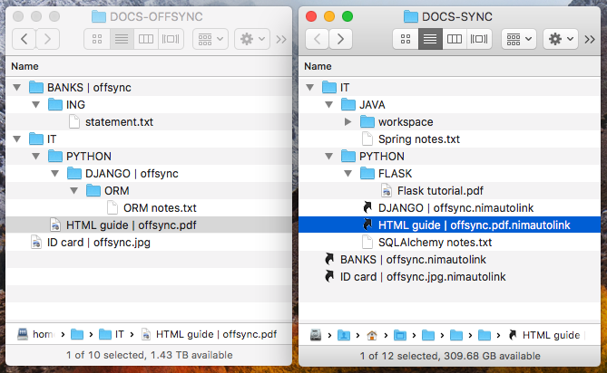

# nimlinks

**nimlinks** is a set of tools for macOS to create and handle special links to files.
These special links overcome a few problems that affect regular symbolic links and macOS aliases when used with
file servers:
 - they are ignored by many sync apps like Synology Drive and Owncloud/Nextcloud
 - they are not flexible enough with remote locations: if a regular symbolic link is created over an AFP connection
 in LAN it won't work when connected to the same remote over a WebDAV connection in WAN.


## Setup
1. Create some symbolic links in your `/usr/local/bin`:
```bash
$ cd nimlinks
$ ln -s $(pwd)/opener/python_opener/nimlinks.py /usr/local/bin/nimlinks
$ ln -s $(pwd)/nimlinks_creator/python_nimlinks_creator/nimlinks_creator.py /usr/local/bin/nimlinks_creator
```
2. Create `config.ini` (see `config.ini.template`)
3. In macOS set `opener/macos_app_opener/nimlinks.app` as default app for opening `.nimlink` and
`.nimautolink` files.
4. Copy `nimlinks_creator/macos_app_service/Create nimlink.workflow` to `~/Library/Services/`


## Usage in macOS
Use a `.nimlink` file in the same way as you would use a regular macOS alias file but when the link is in a
_LOCAL SYNC ROOT_ dir (a dir under a sync app like Synology Drive or Owncloud).   
When you want to move a large file/dir to the _REMOTE OFFSYNC ROOT_ dir (a dir in a remote file server), the you need to
use a `.nimautolink` file.

### :star: How to
- Open a `.nimlink` or `.nimautolink` file: just double click.
- Create a `.nimlink`: right click on the target, then `Services > Create nimlink`
- Move a file/dir offsync to a file server/NAS:
    * Move the file/dir in the _REMOTE OFFSYNC ROOT_, keeping a mirrored dirs structure
    * Append the postfix ` | offsync` to the dir/file name, eg:   
      `.../IT/PYTHON/DJANGO | offsync/`   
      `.../BANKS/statement | offsync.iso`
    * To create the relative `.nimautolink` file run:
    ```bash
    $ nimautolinks_creator/nimautolinks_creator.py
    ```

## More details
The following sections contain more details about the project.

### 2 link types
#### `.nimlink`
They are text files containing a path that points to a target: a *local* or *remote* file/dir. They are
created via the macOS Services context menu.

#### `.nimautolink`
They are empty files. Their own absolute path points to a mirrored target in a _REMOTE OFFSYNC ROOT_. They
are created automatically running `nimautolinks_creator`. See next section.

### Mirrored _REMOTE OFFSYNC ROOT_ and _LOCAL SYNC ROOT_
Files sync apps like Synology Drive or Owncloud/Nextcloud are cool, but usually you want to keep only part of your
documents collection in there. The remaining part is typically stored in a remote offsync root, in a file server.

We call:
 - _LOCAL SYNC ROOT_ the dir in your laptop with your sync'ed documents
 - _REMOTE OFFSYNC ROOT_ the dir in your remote file server with all th eother documents
 
It is handy to keep a mirrored dirs structures between the 2 roots. And mark the files/dirs moved offsycn with the
postfix ` | offsync`. `.nimautolink` file are automatically created to help you navigate from the sync root to the
offsync root.

Example:   



## Development
The project has 3 tools:
 - `opener` dir contains:
    - the macOS app set as default app for `.nimlink` and `.nimautolink` files. You can edit this app with `Automator`.
    This app runs a shell command to call the python opener.
    - the python opener actually handler the `.nimlink` and `.nimautolink` files: it finds the target, mounts the
    remote if necessary and finally opens the target with `Finder`.
 - `nimlinks_creator` dir contains:
    - the macOS service available in the macOS Services context manager for files/dirs. You can edit this service
    with `Automator`. This service runs a shell command to call the python nimlinks creator.
    - the python nimlinks creator actually creates the `.nimlink` file, pointing at the selected dir/file.
 - `nimautolinks_creator` dir contains the python script to run after having moved a dir/file from _LOCAL SYNC ROOT_
 to _REMOTE OFFSYNC ROOT_.

When writing Python code, try to:
 - write code compatible with Python 2 and 3 so that it works in old and new macOS versions
 - do not use any external library, so that no virtualenv is necessary. This way scripts work in any vanilla macOS.

See the `development.md` files in each dir.


## Copyright
Copyright 2019 puntonim (https://github.com/puntonim). No License.